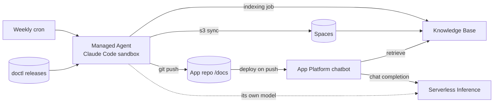

# Docs & Knowledge-Base Curator — a DigitalOcean Managed Agents demo

A weekly **Managed Agent** (Claude Code, in a DO sandbox) reads new
[doctl releases](https://github.com/digitalocean/doctl/releases), writes support docs into a
GitHub repo, regenerates a machine-readable release index, syncs the docs to **Spaces**,
and re-indexes a **Gradient Knowledge Base**. A support chatbot on **App Platform** answers
from that knowledge base using **Serverless Inference**. Nobody on the team touches it.

- App repo (chatbot + docs): [hgonzalez-do/doctl-support-bot](https://github.com/hgonzalez-do/doctl-support-bot)
- This repo: deployment scripts, agent spec and prompt, architecture, demo script.

Read next: [docs/architecture.md](docs/architecture.md) · [docs/demo-script.md](docs/demo-script.md) · [docs/other-demo-ideas.md](docs/other-demo-ideas.md)

## What you need

Accounts and keys (all created in the DigitalOcean control panel):

| Item | Where | Used by |
|---|---|---|
| API token (full access) | API → Tokens | setup scripts, curator agent |
| API token (GenAI read only) | API → Tokens, scoped | chatbot runtime (optional for a demo) |
| Model access key | Gradient AI Platform → Serverless Inference | chatbot and the agent's model |
| Spaces access key pair | API → Spaces Keys | docs sync |
| GitHub app authorized for your account | App Platform → GitHub | deploy on push |
| Managed Agents private preview | Design Partner Guide | `doctl agent` commands |

Local tools: `doctl`, `gh`, `aws` CLI, `jq`, `python3`, `node` 20+, `git`.

## Quick start

```bash
git clone https://github.com/hgonzalez-do/doctl-support-bot.git
git clone https://github.com/hgonzalez-do/managed-agents-kb-curator-demo.git
cd managed-agents-kb-curator-demo
cp .env.example .env        # fill in tokens, bucket name, GitHub owner
```

Then run the scripts in order. Each one is short, idempotent and prints what it did.
Generated IDs are saved to `.state.env` so later scripts pick them up.

| Step | Script | Creates |
|---|---|---|
| 0 | `scripts/00-preflight.sh` | nothing; checks tools, tokens, repos |
| 1 | `scripts/01-create-spaces-bucket.sh` | Spaces bucket, uploads `docs/` |
| 2 | `scripts/02-create-knowledge-base.sh` | Knowledge base + Spaces data source, waits for first index, smoke-tests retrieval |
| 3 | `scripts/03-deploy-app.sh` | App Platform app from `app-platform/app.yaml` |
| 4 | `scripts/04-start-agent.sh` | Managed Agent session from `agent/spec.yaml` with a weekly cron |
| 5 | `scripts/05-demo-rewind.sh [N]` | stages a live demo by removing the newest N releases from docs + KB |
| 6 | `scripts/06-cleanup.sh` | deletes everything above |

## How the pieces fit



## Files

```
.env.example                 every variable you might change, with comments
scripts/lib.sh               shared helpers (env loading, templating, API polling)
scripts/0*-*.sh              numbered setup / demo / cleanup steps
app-platform/app.yaml        App Platform spec (templated)
agent/spec.yaml              Managed Agents session spec (templated)
agent/prompts/curator.md     the agent's runbook
docs/                        architecture, demo script, other demo ideas
```

## Variables

All in `.env.example`. The ones people usually change:

| Variable | Default | Meaning |
|---|---|---|
| `GITHUB_OWNER` / `APP_REPO` | `hgonzalez-do` / `doctl-support-bot` | Repo the agent maintains and App Platform deploys |
| `SPACES_REGION` / `SPACES_BUCKET` | `nyc3` / (unique name) | KB data source |
| `KB_REGION` | `tor1` | Knowledge base region |
| `INFERENCE_MODEL` | `anthropic-claude-haiku-4.5` | Chatbot model (any catalog model ID) |
| `AGENT_MODEL` | `anthropic-claude-4.5-sonnet` | Model the coding agent uses |
| `AGENT_CRON` | `0 9 * * 1` | Curator schedule (UTC) |

## Managed Agents notes (private preview)

- `doctl agent …` comes from the preview build in the Design Partner Guide. Stock doctl
  does not have it yet. `04-start-agent.sh` and `agent/spec.yaml` follow the guide's
  structure (agent, model, github, secrets, env, policy, triggers); adjust field names if
  your build differs.
- Credentials go in `spec.secrets`, never `spec.env`. `spec.env` values are debug-readable
  in the sandbox.
- First prompt latency is roughly 10 to 13 seconds today (sandbox creation is about 1.5 s;
  the agent runtime warms up after). Plan the demo narration around that.
- Not yet available: custom container images, single-invoice billing, live port-forward
  previews, VPC access. Nothing here depends on them.

## Security posture

- Chatbot: read-only GenAI token + model access key, both as App Platform secrets.
- Agent: full-access token, Spaces keys and model key via Secrets Manager. Policy allows
  one repo, `aws s3` to one bucket, DO API and GitHub API only. Everything else is denied.
- Every change lands as a git commit you can review or revert.

## Cost

Agent session pauses between runs (billed for minutes worked). App Platform basic instance,
one small Spaces bucket, one knowledge base, per-token inference. Run `06-cleanup.sh` when done.
