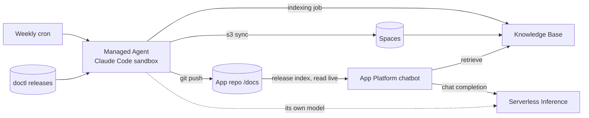

# Docs & Knowledge-Base Curator — a DigitalOcean Managed Agents demo

A weekly **Managed Agent** (Claude Code, in a DO sandbox) reads new
[doctl releases](https://github.com/digitalocean/doctl/releases), writes support docs into a
GitHub repo, regenerates a machine-readable release index, syncs the docs to **Spaces**,
and re-indexes a **Gradient Knowledge Base**. A support chatbot on **App Platform** answers
from that knowledge base using **Serverless Inference**. Nobody on the team touches it.

- App repo (chatbot + docs): [hgonzalez-do/doctl-support-bot](https://github.com/hgonzalez-do/doctl-support-bot)
- This repo: deployment scripts, agent spec and prompt, architecture, demo script.

Read next: [docs/architecture.md](docs/architecture.md) · [docs/demo-script.md](docs/demo-script.md) · [docs/action-gateway-variant.md](docs/action-gateway-variant.md) · [docs/other-demo-ideas.md](docs/other-demo-ideas.md)

## What you need

Accounts and keys (all created in the DigitalOcean control panel):

| Item | Where | Used by |
|---|---|---|
| API token (full access) | API → Tokens | setup scripts, curator agent |
| API token (GenAI read only) | API → Tokens, scoped | chatbot runtime (optional for a demo) |
| Model access key | Gradient AI Platform → Serverless Inference | chatbot and the agent's model |
| Spaces access key pair | API → Spaces Keys | docs sync |
| GitHub linked to your DO account | App Platform → Create App → GitHub | deploy on push (`APP_SOURCE=github`); otherwise set `APP_SOURCE=git` |
| GitHub connected to Managed Agents | `doctl agent auth github` | agent clone/push (`GITHUB_TOKEN: oauth/github`) |
| Managed Agents private preview | Design Partner Guide | `doctl agent` commands |

Local tools: `doctl` (beta build for the agent commands), `aws` CLI, `jq`, `python3`, `node` 20+, `git`.

## Quick start

```bash
git clone https://github.com/hgonzalez-do/doctl-support-bot.git
git clone https://github.com/hgonzalez-do/managed-agents-kb-curator-demo.git
cd managed-agents-kb-curator-demo
cp .env.example .env        # fill in tokens, bucket name, GitHub owner
```

Then run the scripts in order. Each one is short, idempotent and prints what it did.
Generated IDs are saved to `.state.env` so later scripts pick them up.

| Step | Script | Creates |
|---|---|---|
| 0 | `scripts/00-preflight.sh` | nothing; checks tools, tokens, repos |
| 1 | `scripts/01-create-spaces-bucket.sh` | Spaces bucket, uploads `docs/` |
| 2 | `scripts/02-create-knowledge-base.sh` | Knowledge base + Spaces data source, waits for first index, smoke-tests retrieval |
| 3 | `scripts/03-deploy-app.sh` | App Platform app from `app-platform/app.yaml` |
| 4 | `scripts/04-create-trigger.sh` | validates the policy, creates the weekly cron trigger (and optional GitHub webhook trigger) from `agent/spec.yaml` |
| 5 | `scripts/05-demo-rewind.sh [N]` | stages a live demo by removing the newest N releases from docs + KB |
| 6 | `scripts/06-run-curator-now.sh` | runs the curator now from the same spec: attached (default), `--headless`, or `--dry-run` to print the resolved manifest |
| 7 | `scripts/07-cleanup.sh` | deletes everything above |

Prefer to run the Managed Agents commands by hand? `scripts/render-agent-spec.sh` writes the
fully rendered spec to `.rendered/agent-spec.yaml` and prints ready-to-paste `doctl agent`
commands (validate, dry-run, live run, cron trigger) with absolute paths, so they work from
any directory.

One-time, before step 4:

```bash
doctl agent auth github     # connects your team's GitHub account (browser flow) for GITHUB_TOKEN: oauth/github
```

## How the pieces fit



## Files

```
.env.example                 every variable you might change, with comments
scripts/lib.sh               shared helpers (env loading, templating, API polling)
scripts/0*-*.sh              numbered setup / demo / cleanup steps
app-platform/app.yaml        App Platform spec, GitHub source with deploy-on-push (needs GitHub linked to DO)
app-platform/app.public-git.yaml  same app from a public clone URL (no GitHub link needed)
agent/spec.yaml              Managed Agents spec (templated; runbook spliced in as a skill)
agent/prompts/curator.md     the agent's runbook
docs/                        architecture, demo script, other demo ideas
```

## Variables

All in `.env.example`. The ones people usually change:

| Variable | Default | Meaning |
|---|---|---|
| `GITHUB_OWNER` / `APP_REPO` | `hgonzalez-do` / `doctl-support-bot` | Repo the agent maintains and App Platform deploys |
| `SPACES_REGION` / `SPACES_BUCKET` | `nyc3` / (unique name) | KB data source |
| `KB_REGION` | `tor1` | Knowledge base region |
| `INFERENCE_MODEL` | `llama-4-maverick` | Chatbot model (any DO-hosted catalog model ID) |
| `AGENT_MODEL` | `deepseek-v4-pro` | DO-hosted model the coding agent uses |
| `AGENT_SIZE` | `mars-2vcpu-4gb` | Sandbox size |
| `AGENT_CRON` / `AGENT_TIMEZONE` | `0 9 * * 1` / `UTC` | Curator schedule |
| `OUTPUT_MODE` / `OUTPUT_EMAIL` | `email` | Where each run's report is delivered |

## Managed Agents notes (private preview)

- `doctl agent …` ships in the doctl **beta** build (GitHub pre-release), not the standard
  release. Your DigitalOcean contact must also enable the feature on your team; until then
  agent commands return 404.
- `agent/spec.yaml` follows the full MARS agents.yaml format (identity, runtime, repos, env,
  secrets, size/timeouts, skills, permissions, budget). The rendered file can be imported in
  the console as an Agent, saved with `doctl agent config create --spec`, or passed directly to
  `doctl agent start` / `doctl agent triggers create`.
- The spec uses the platform's `HARNESS_INFERENCE_*` variables so the coding agent
  itself runs on a DigitalOcean-hosted model. To bring your own key instead, replace them with
  `ANTHROPIC_MODEL` in `env` and `ANTHROPIC_API_KEY` in `secrets`.
- GitHub access is `GITHUB_TOKEN: "oauth/github"` in `secrets`, minted from the team's OAuth
  connection. The agent never sees a personal access token. Sessions are team-level, so use a
  dedicated GitHub account for `doctl agent auth github` in a real deployment.
- Triggered runs are unattended: the policy must not contain `ask`. The spec uses
  `default: allow` plus explicit `deny` rules. Validate it any time with
  `doctl agent validate <rendered spec>` (step 4 and the render script do this for you).
- The runbook is sent in full as the trigger / session prompt and is also attached as a
  **skill** (skills are accepted but not yet enforced in the preview). One runbook file,
  `agent/prompts/curator.md`, drives cron, webhook and attended sessions alike.
- GitHub OAuth (`oauth/github`) is likewise accepted but not yet enforced. Until it is, set
  `GITHUB_FINE_GRAINED_PAT` (one-repo token) so the agent can push.
- Action Gateway can replace the in-sandbox tokens later; see
  [docs/action-gateway-variant.md](docs/action-gateway-variant.md).
- `doctl agent start <spec> --prompt "..."` sends the prompt as soon as the session is ready;
  add `--on-hitl approve` for a headless run, or `--dry-run` to print the resolved manifest
  with secrets redacted. `doctl agent prompt <session> "..."` sends a follow-up.
- Credentials go in `spec.secrets`, never `spec.env`. `spec.env` values are debug-readable
  in the sandbox.
- First prompt latency is roughly 10 to 13 seconds today (sandbox creation is about 1.5 s;
  the agent runtime warms up after). Plan the demo narration around that.
- Not yet available: custom container images, single-invoice billing, live port-forward
  previews, VPC access. Nothing here depends on them.

## Security posture

- Chatbot: read-only GenAI token + model access key, both as App Platform secrets.
- Agent, three layers of repo confinement:
  1. **Credential scope.** Default is the team's GitHub OAuth connection (account-wide). Set
     `GITHUB_FINE_GRAINED_PAT` to a token that can only see `GITHUB_OWNER/APP_REPO` and the
     agent physically cannot touch anything else.
  2. **Policy engine.** `git clone` is allowed only for that repo URL and denied otherwise;
     `git push` is allowed only as the exact `git push origin main`; adding or changing remotes
     and the `gh` CLI are denied. Rules match literally, so validate on a live session.
  3. **Runbook.** The skill tells the agent to work only in that repo and only under `docs/`.
  Other secrets: full-access DO token, Spaces keys and model key via Secrets Manager. Tighten
  further with a GenAI-scoped token and a bucket-scoped Spaces key for a real deployment.
- Every change lands as a git commit you can review or revert.

## Cost

Agent session pauses between runs (billed for minutes worked). App Platform basic instance,
one small Spaces bucket, one knowledge base, per-token inference. Run `07-cleanup.sh` when done.
