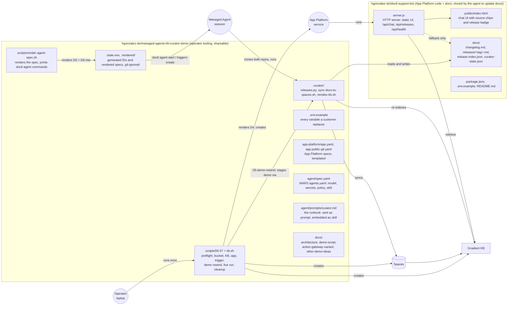

# Architecture

Two loops share one knowledge base. The **curation loop** runs weekly with no human in it.
The **answer loop** runs on every chat message. Nothing in the answer loop can write; nothing
in the curation loop serves users.

## How it operates

```mermaid
flowchart TB
  subgraph CUR["Curation loop — Managed Agent, weekly cron (Mon 09:00 UTC), unattended"]
    direction TB
    TRG[Cron trigger<br/>fresh session from agent spec] --> SESS[Sandbox session<br/>OpenCode harness<br/>model: deepseek-v4-pro via Serverless Inference]
    SESS -->|1. git clone both repos| REPO
    SESS -.->|1. git clone, read-only| TOOLS[(GitHub<br/>managed-agents-kb-curator-demo<br/>curator/ tooling)]
    SESS -->|2. curator/releases.py fetch| GHREL[(GitHub API<br/>digitalocean/doctl releases)]
    SESS -->|3. write docs/releases/&lt;tag&gt;.md<br/>4. releases.py index| WS[/workspace: docs/ changelog,<br/>release-index.json, bookmark/]
    WS -->|5. git push origin main| REPO[(GitHub<br/>hgonzalez-do/doctl-support-bot)]
    WS -->|6. curator/sync-docs-to-spaces.sh<br/>aws s3 sync --delete| SP[(Spaces bucket<br/>docs/ prefix)]
    SESS -->|7. curator/reindex-kb.sh<br/>POST /v2/gen-ai/indexing_jobs, poll| KB
    SP -->|indexing job reads| KB[Gradient Knowledge Base<br/>GTE Large embeddings]
    SESS -->|8. retrieve check, run report| MAIL[Email report]
  end

  subgraph ANS["Answer loop — App Platform, per request"]
    direction LR
    U[User browser] -->|POST /api/chat| APP[doctl-support-bot<br/>node server.js]
    APP -->|POST kbaas.do-ai.run/v1/KB/retrieve<br/>hybrid search, top 6| KB
    APP -->|POST inference.do-ai.run/v1/chat/completions<br/>llama-4-maverick + retrieved chunks| SI[Serverless Inference]
    APP -->|answer + cited sources| U
    APP -.->|GET /api/releases: release-index.json<br/>raw GitHub, 60 s cache| REPO
  end

  SM[(Secrets Manager)] -. spec.secrets: model key, DO token,<br/>Spaces keys, GitHub token .-> SESS
  POL[Policy engine<br/>allow by default; strict deny:<br/>clone other repos, push except origin main,<br/>new remotes, gh, rm -rf, curl pipe sh] -. governs .-> SESS
  SESS -.->|its own model calls| SI
```

Credentials, by component:

| Component | Holds | Scope |
|---|---|---|
| Chatbot (App Platform) | DO API token (GenAI read), model access key | read the KB, call inference |
| Curator (sandbox) | model access key, DO API token, Spaces key pair, GitHub token | via Secrets Manager; GitHub token can be a one-repo fine-grained PAT |
| Operator (laptop) | full-access DO token, Spaces keys | one-time setup, demo staging, cleanup |

## Folder structure and who uses what



## Why this shape

- **Docs in git, not just in the KB.** Every change the agent makes is a commit a human can
  review, revert or diff. The KB is a projection of the repo; Spaces is the transport because
  Knowledge Bases ingest from Spaces (there is no GitHub data source).
- **A deterministic core with an LLM around it.** `curator/releases.py` (in this repo) does
  fetching, parsing and index regeneration. The agent's judgment is spent on the part that needs it: writing
  summaries and upgrade notes a support engineer would want.
- **Retrieval separated from generation.** The bot calls the KB retrieve API directly and
  passes chunks to Serverless Inference. Model choice is a config value (`INFERENCE_MODEL`).
- **Read-live release index.** The chatbot fetches `release-index.json` from GitHub with a
  60 s cache, so its "docs current through" badge flips the moment the agent pushes, whether
  or not App Platform redeploys.
- **Clean split of repos.** The app repo is only App Platform code plus the docs it answers
  from. Everything about the agent (spec, runbook, tooling) lives in this repo, which the agent
  clones read-only.
- **Least privilege by construction.** The app runs with a read token. The agent may clone
  exactly two repos and push to exactly one (`git push origin main` in the app repo), enforced
  by credential scope (fine-grained PAT), policy rules, and the runbook.

## The "OpenAPI spec" step, adapted

The original brief regenerates an OpenAPI spec. doctl is a CLI, so the equivalent
machine-readable artifact here is `docs/release-index.json`, which the app serves at
`/api/releases`. For an API-first customer, swap that step for regenerating their spec from
source and dropping it into `docs/` so it is indexed too.
